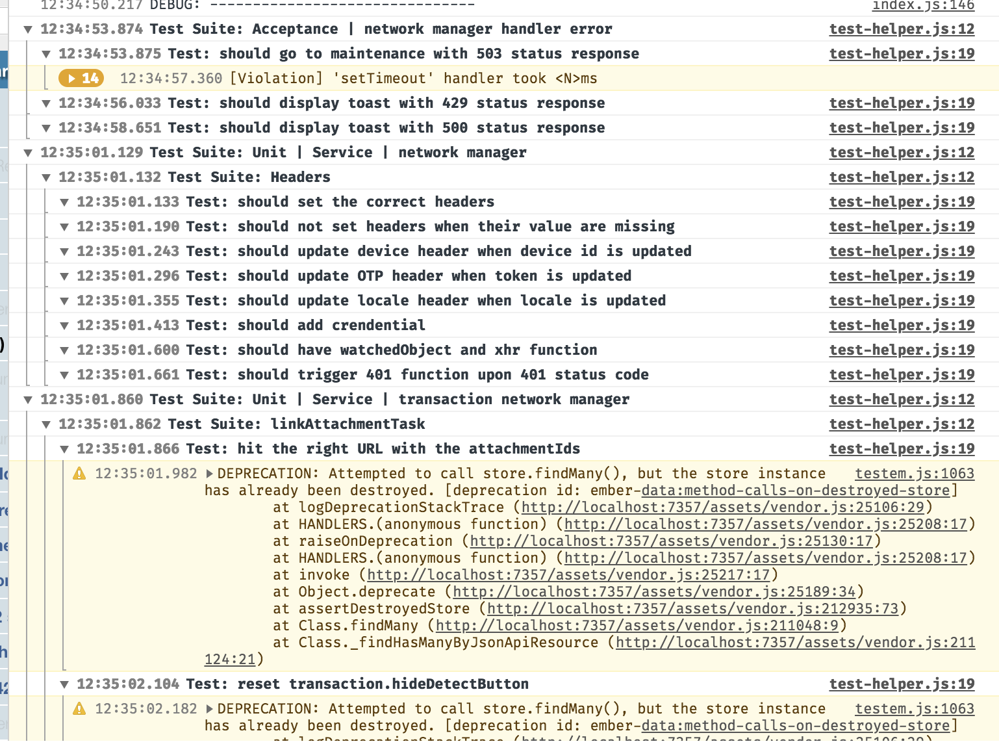

qunit-console-grouper
==============================================================================

[![TravisCI Build Status][travis-badge]][travis-badge-url]
[![Latest NPM release][npm-badge]][npm-badge-url]

[npm-badge]: https://img.shields.io/npm/v/qunit-console-grouper.svg
[npm-badge-url]: https://www.npmjs.com/package/qunit-console-grouper
[travis-badge]: https://img.shields.io/travis/com/simplabs/qunit-console-grouper/master.svg
[travis-badge-url]: https://travis-ci.com/simplabs/qunit-console-grouper

[QUnit](https://qunitjs.com/) plugin that groups console messages by test




Install
------------------------------------------------------------------------------

### npm

```bash
npm install --save-dev qunit-console-grouper
```

or using [`yarn`](https://yarnpkg.com/):

```bash
yarn add --dev qunit-console-grouper
```

(This is the recommended method for Ember projects.)

### `<script>` Tag

Load `qunit-console-grouper.js` *after* `qunit.js`:

```html
<script src="https://unpkg.com/qunitjs/qunit/qunit.js"></script>
<script src="https://unpkg.com/qunit-console-grouper/lib/qunit-console-grouper.js"></script>
```


License
------------------------------------------------------------------------------

qunit-console-grouper is developed by and &copy;
[simplabs GmbH](http://simplabs.com) and contributors. It is released under the
[MIT License](https://github.com/simplabs/qunit-console-grouper/blob/master/LICENSE.md).
